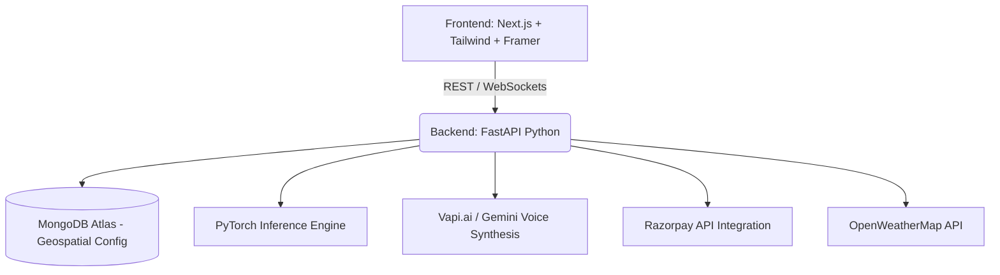

<div align="center">
  
  
  <h1>🌿 Plant Doctors AI</h1>
  <h3>The Billion-Dollar Agritech Experience</h3>
  
  <p>
    <b>Empowering Farmers with Cutting-Edge AI, Localized Intelligence, and Precision Agriculture.</b>
  </p>
  
  <div>
    
    
    
    
    
  </div>
</div>

---

## 🚀 Welcome to the Future of Farming

**Plant Doctors** is a state-of-the-art agricultural platform designed to bridge the gap between rural farming and advanced artificial intelligence. By combining high-accuracy computer vision, multi-lingual voice assistants, and community-driven threat mapping, we deliver an unprecedented precision farming experience.

Our core mission is simple: **Zero Crop Loss. Maximum Yield.**

---

## 💎 Core Capabilities & Features

### 1. 🔍 AI Crop Scanner
- **High-Accuracy Disease & Pathogen Detection**: Utilizing MobileNetV3-Large baked into an optimized PyTorch pipeline trained on 38+ crop disease classes and 38,000+ annotated leaf images.
- **Real-Time AR Viewfinder**: An immersive, haptic-feedback enabled scanning experience.
- **Smart Dosage Calculator**: Automatically calculates chemical to water mix ratios based on farm acreage and localized ground soil data.
- **Automated PDF Reports**: Generates downloadable diagnostic PDFs in 7 regional languages for offline reference.

### 2. 🎙️ Localized Voice AI (Powered by Vapi.ai & Gemini)
- **Outbound Expert Calling**: Smart AI agents that call farmers to ask diagnostic questions in their local dialects (Hindi, Bhojpuri, Punjabi, Marathi, etc.).
- **Voice Commands**: Fully integrated voice navigation for low-literacy users. "Mera aalu chota hai" instantly routes to potato growth care recommendations.

### 3. 🌍 Geo-Threat Network
- **Community Outbreak Mapping**: Live spatial monitoring of nearby pest outbreaks.
- **Early Warnings**: Proactive alerts notifying farmers when spatial density threshold of disease reports is detected within a 10km radius.
- **Live OpenWeatherMap Integration**: Rain, heat-wave, and wind alerts to strategically prevent farmers from wasting pesticide during adverse climates.

### 4. 🛒 Premium Agritech Marketplace
- **C2C & B2B Purchasing**: Connects farmers directly with pesticide sellers and heavy-machinery renters (tractors, harvesters).
- **Embedded Razorpay Integration**: Direct checkout support with equipment rental micro-financing options.

---

## 🏛️ Platform Policies & Architecture Vision

As a market-leading agritech organization, we design with the following **Core Principles** to protect and serve our farmers.

### 🛡️ 1. Absolute Data Privacy & Protection
We understand that farm yield data and land acreage are sensitive. 
- **Zero Third-Party Data Selling**: We do not sell crop health data, GPS locations, or mobile numbers to third-party ad networks or corporate agribusinesses.
- **Privacy-First Storage**: All voice logs, crop scans, and chat histories are stored securely.

### ⚖️ 2. AI Ethics & Transparency
We recognize the physical cost of bad AI advice.
- **Confidence Thresholds**: If our AI is below confidence thresholds in a disease diagnosis, it will flag uncertainty and recommend human expert verification.
- **Safe Recommendations**: Our recommendation engines are programmed to prioritize organic and safe alternatives first.

### ⏱️ 3. Expert Agronomist Network (Target SLA)
- **Fast Agronomist Connect**: Target 15-minute escalation workflow for critical outbreaks (e.g., sudden blight or swarms) to connect farmers with verified specialists.

### 💳 4. Transparent Marketplace Pricing
- **No Hidden Fees**: Equipment rentals are explicitly priced per hour/day with clear checkout breakdowns.

---

## 💻 Technical Architecture

Plant Doctors utilizes a highly decoupled architecture for maximum scalability across rural 3G/4G networks.



#### Frontend Stack (Web & PWA)
- **Next.js** (App Router)
- **TailwindCSS** + Vanilla CSS for ultra-premium Glassmorphism UI.
- **Framer Motion** for micro-interactions and animations.
- **Lucide React** for icons.

#### Backend Stack
- **FastAPI** for asynchronous, extremely high-throughput API routing.
- **Motor (Asyncio)** for non-blocking MongoDB communication.
- **PyTorch** for MobileNetV3 disease diagnosis.
- **ReportLab / FPDF** for dynamic, multi-lingual PDF generation.
- **Vapi.ai & Google Gemini** for Voice & Conversational AI.

---

## 🛠️ Quick Local Setup

> [!CAUTION]
> Ensure you have Python 3.10+ and Node.js 18+ installed before proceeding.

### 1. Backend Setup

It is strongly recommended to have **MongoDB** and **Redis** running locally before starting the server.

```bash
cd backend
python3 -m venv .venv
source .venv/bin/activate
pip install -r requirements.txt

# Rename environment file
cp .env.example .env

# Start FastAPI Server (Runs on port 8000)
uvicorn app.main:app --reload
```

### 2. Frontend Setup
```bash
cd web
npm install

# Start Next.js Development Server (Runs on port 3000)
npm run dev
```

---

## 📜 Complete Delivery Documentation Index
If you are looking for specific phase deliveries, architectural blueprints, or UI/UX mockups, please refer to the detailed documentation suite linked below:

| Documentation category | Quick Link |
|-----------------------|------------|
| **Meet the Team** | [`TEAM.md`](./TEAM.md) |
| **Business Strategy & Revenue Plan** | [`BUSINESS_PLAN.md`](./BUSINESS_PLAN.md) |
| **Project Architecture & Folders** | [`ARCHITECTURE.md`](./ARCHITECTURE.md) |

---
<div align="center">
  <p>Built with ❤️ for the Global Farming Community.</p>
</div>

